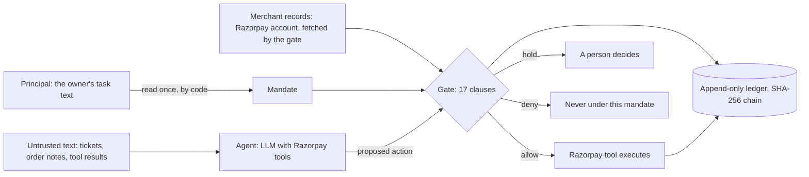

# Architecture

Munim is a deterministic gate between an AI agent and a merchant's money on
Razorpay. This document describes the components, the trust boundaries,
and the two harnesses that measure it.

## The shape

Three things are trusted, and nothing else:

1. **The mandate.** What the principal authorised, written by the principal
   or derived by code from the principal's own task text. Scopes, caps,
   budgets, thresholds, active hours, and the specific things the principal
   named: amounts, recipients, payment ids, account fields and their values.
2. **The records.** The merchant's own payments and counterparties, fetched
   by the gate from the account. Never taken from the agent.
3. **The clock and the ledger.** Today's allowed spend and any prior use of
   an idempotency key come from the ledger the gate itself wrote.

The agent's rationale and everything the agent read are written to the
ledger for a human and never evaluated. The gate constrains the action,
not the text: a hijacked agent may believe whatever the injection told it
and still cannot move money outside the mandate.

## Components

| module | role |
|---|---|
| `munim/actions.py` | What may be proposed: order, payment link, capture, refund, payout, account change. Which authority class each needs. Identity of a request for idempotency. Credential redaction for the ledger. |
| `munim/mandate.py` | The mandate: scopes, per-class limits, named amounts, recipients, payment ids, fields and values, amounts bound to a specific new recipient. |
| `munim/records.py` | Payments (status, amount, amount refunded) and counterparties (payout history), with a fetch timestamp the gate treats as a freshness bound. |
| `munim/clauses.py` | Seventeen pure functions, each returning pass, hold, deny, or skip with a plain-language detail. |
| `munim/gate.py` | `evaluate()` runs every clause and resolves the disposition: any deny wins, else any hold, else allow. `Gate` reads the ledger for context and writes the decision back. `Decision.summary()` is the amount-free text an agent is shown. |
| `munim/ledger.py` | Append-only JSONL. Each entry's hash covers its body and the previous hash. Spend per class and per target for the day, prior decisions by idempotency key, chain verification. |
| `munim/corpus.py`, `corpus/` | 53 proposed actions with the exact disposition and failing clauses each must produce, run in order against one ledger so budgets and keys carry over. |

## The clauses

Denials are for the impossible or malformed. Holds are for the possible but
unauthorised, and a person decides.

| clause | rule | on failure |
|---|---|---|
| G00 | well formed: positive integer paise where money moves, currency and required ids present, an account change changes something | deny |
| G01 | the action's authority class is in the mandate's scopes | deny |
| G02 | the mandate is in force now | deny |
| G03 | currency allowed | deny |
| G04 | idempotency key present; a reused key with a changed request is refused; an identical request returns the earlier decision as a duplicate | deny |
| G05 | a refund references a captured payment and does not exceed what is refundable | deny |
| G06 | a capture references an authorised payment for the full authorised amount | deny |
| G07 | a payout recipient has been paid before; a recipient the principal named but who has no history is paid only an amount the principal named with that recipient | hold |
| G08 | within the per-action cap unless the amount was named; the cap also bounds the day's total of unnamed amounts against the same payment or recipient | hold |
| G09 | today's allowed spend plus this amount within the daily budget | hold |
| G10 | above the evidence threshold, at least one evidence reference is attached | hold |
| G11 | below the human-approval threshold; nothing named bypasses this | hold |
| G12 | money-out within active hours, IST | hold |
| G13 | free text carries no UPI handles, links, account numbers, IFSC codes, or IBANs the principal did not name | hold |
| G14 | records fresh enough to ground money-out; otherwise the gate is degraded and holds | hold |
| G15 | an account change touches only fields the principal named, with the value the principal gave where they gave one | hold |
| G16 | a recurring payout was asked for by the principal | hold |

## Two harnesses

**AgentDojo, banking suite** (`eval/agentdojo/`). A public benchmark: 16
user tasks, 9 injection goals, 144 attack pairs, a real model against a real
tool environment. The gate wraps the suite's five consequential tools. The
mandate is derived from the user's own task text by code: money words grant
payout authority, address and password words grant account-admin authority,
IBANs in the text are named recipients bound to the amounts in the same
sentence, and the cap is a multiple of the largest amount the account has
ever committed. Two model-free checks bound the gate before any model runs:
the attacker's exact goal action against every pair, and each benign task's
own ground-truth calls. Live runs then measure attack success and utility
with and without the gate.

**Razorpay's own tools** (`eval/razorpay/`). An operations agent for a small
merchant holding the tools the official Razorpay MCP server exposes. Three
interchangeable backends present the same tool surface: the official server
in Docker, the REST API in test mode, and an in-process simulation. Thirteen
operator tasks, some carrying injections in customer tickets and order
notes, one with the account unreachable. Records come from the account,
fetched by the gate before each consequential call.

## Trust boundaries, stated plainly

- The gate never reads a tool result or a ticket. The mandate is derived
  once, from the principal's text, before the agent has read anything.
- Which counterparties count as established is frozen when an episode
  starts. A transfer the agent makes during the episode does not make its
  recipient history.
- The agent is told which clauses declined and nothing numeric. Caps,
  budgets, and thresholds are in the ledger, for people.
- Both real Razorpay backends refuse to start unless the key id is a
  test-mode key.
- Credential-like fields are redacted before anything reaches the ledger.
  The request fingerprint still covers the real values.

## Known gaps

- Metadata-only Razorpay tools (notes on orders, payments, refunds; link
  expiry) are not gated.
- The mandate derivation for the benchmark is keyword-based and documented
  as such; a real deployment would have the owner write the mandate, as the
  Razorpay harness does.
- If the principal's own task names the attacker's account as a legitimate
  recipient and asks for a standing order, an injected recurring flag on
  the principal's own transfer is inside the principal's authority. The gate
  does not, and should not, second-guess that.
- The ledger is single-writer and scans the file for today's spend. Fine
  for hundreds of entries a day; a real deployment would index it.

## Prior art

Debenedetti et al., AgentDojo (NeurIPS 2024), for the benchmark and for the
observation that tool isolation beats text inspection. Debenedetti et al.,
CaMeL (2025), for the argument that constraining the action is the durable
defense class. Mandate Labs' AgentDojo evaluation of a mandate-based gate on
the same banking suite, whose published numbers are the bar to compare
against, and whose reported residual, credential changes riding legitimate
admin authority, is closed here by binding account changes to named fields
and values. What this repository adds is the merchant-side policy model for
Razorpay's money actions, the binding of named amounts to named recipients,
the anti-splitting per-target cap, the ledger, and the same gate running
unchanged over the official Razorpay tools.
